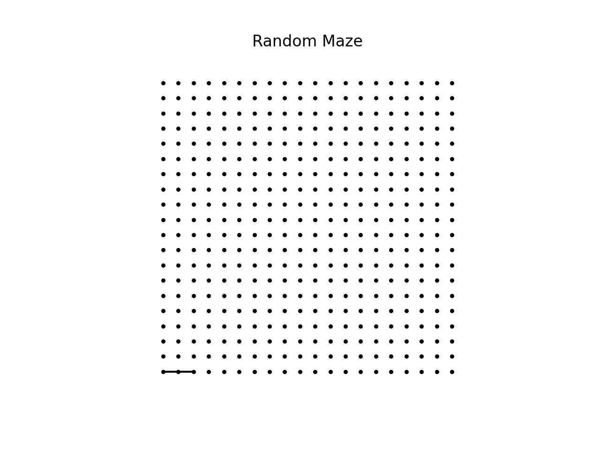

# Random Maze

A random maze generation algorithm using graph traversal.
Implementation of the algorithm describe
[here](https://en.wikipedia.org/wiki/Maze_generation_algorithm#Iterative_implementation_(with_stack)).

